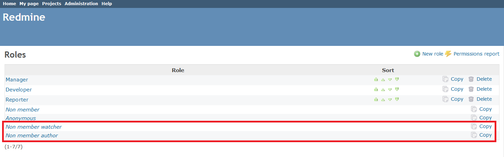
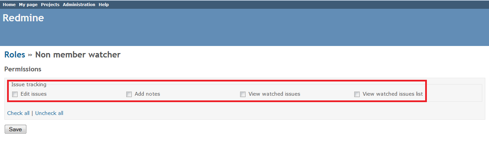
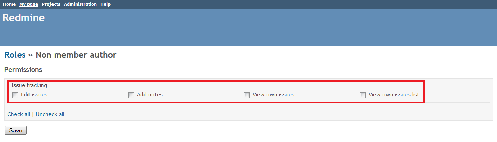

# Redmine Non Member Watcher Plugin

This plugin adds two new system roles to Redmine, **Non member watcher** and **Non member author**. With these roles, you can set permissions for watchers and issue authors who are not the project members. 

## Compatibility

This plugin is compatible only with Redmine 3.x and later.

## Installation

1. To install the plugin
    * Download the .ZIP archive, extract files and copy the plugin directory into *#{REDMINE_ROOT}/plugins*.
    
    Or

    * Change you current directory to your Redmine root directory:  

            cd {REDMINE_ROOT}
 
      Copy the plugin from GitHub using the following command:

            git clone https://github.com/Restream/redmine_non_member_watcher.git plugins/redmine_non_member_watcher

2. Install the required gems using the command:  

        bundle install  

3. Restart Redmine.

Now you should be able to see the plugin in **Administration > Plugins**.

## Usage

The plugin adds two new roles to **Administration > Roles and Permissions**:

You can set the following issue tracking permissions for the **Non member watcher** role:

* Edit issues
* Add notes
* View watched issues
* View watched issues list

You can set the following issue tracking permissions for the **Non member author** role:

* Edit issues
* Add notes
* View own issues
* View own issues list

## Maintainers

Danil Tashkinov, [github.com/nodecarter](https://github.com/nodecarter)

## License

Copyright (c) 2016 Restream

Licensed under the Apache License, Version 2.0 (the "License");
you may not use this file except in compliance with the License.
You may obtain a copy of the License at

http://www.apache.org/licenses/LICENSE-2.0

Unless required by applicable law or agreed to in writing, software
distributed under the License is distributed on an "AS IS" BASIS,
WITHOUT WARRANTIES OR CONDITIONS OF ANY KIND, either express or implied.
See the License for the specific language governing permissions and
limitations under the License.